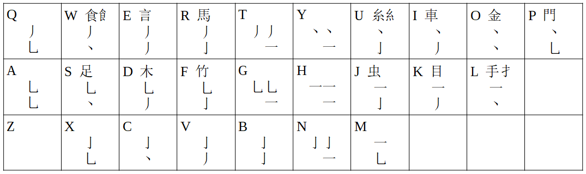

# rime-pof-input-method
Pairs-of-five-strokes: An input method for writing Chinese characters on computers, 
primarily developed for the RIME input method editor.

# About the POF input method

Sound based input methods for chinese have been getting
better and better with predictive text enhancements,
but shape based input methods still have one big advantage
over the sound based ones: 
they help preventing character amnesia (提筆忘字).
The main problem with shape based input methods is that they are
hard to learn. This is because in order to be practical, 
any shape based system has to allow the user to write any character
with about the same number of keystrokes as sound based systems.
This means that in order to prevent ambiguity 
(the same keystrokes can write a large number of different characters)
the shape based systems use very complicated rules that make them hard to lean.

The motivation for creating the POF system was thus to create
a system that was easy to lean, could write any (common use)
character without the need for scrolling through a list,
yet using no more than 4 keystrokes plus the 1-9 numberkeys
for selection.

Here "common use" means that when using the POFsimp dict and schema files, 
you can write any of the first 5000 characters in this frequency list without
scrolling:

https://lingua.mtsu.edu/chinese-computing/statistics/char/list.php?Which=IM

When using the POFtrad dict and schema files, you can write 
any of the first 5000 characters in this frequency list without scrolling:

http://technology.chtsai.org/charfreq/sorted.html

To make it easy to learn, POF is fundamentally based on strokeorder.
It uses the standard 5 strokes in this order:

horizontal: 一 （heng 横， ti 提）

vertical： 丨 （shu 竖 gou 钩）

left： 丿 （wan 弯 pie 撇）

right： 丶 （dian 点 na 捺）

bent： 乚 （all the bent strokes, for example
heng gou 横钩 shu wan 竖弯 ect.）

Each key correspond to two strokes according to this table:

For example, by pressing “g” you can write characters 
like 乙 （a single bent stroke）or 刁 （a bent stroke plus a horizontal stroke）
by pressing “m” you can write for example 七 or 匕

To write more complex characters, you combine keys like this:

戈 mw  (m 一乚 + w 丿丶 )

If the number of strokes is uneven, for the last stroke you 
use one of the keys where the second stroke is 一, that is you use either
T, Y, G, H or N:

戋 hdy （h 一一 + d 乚丿 + y 丶）

If the number of strokes is greater than 8, so you cant 
write the whole character with 4 keystrokes, you type the 
keys for the first 6 strokes, and the last two:

過 xnxs （x 亅乚 + n 亅一 + x 亅乚 + s 乚丶）

Some characters have a very complex set of strokes in the beginnning 
of the character that occur again and
again in many characters. This means that the 
last two strokes you would write with the last key are not enough 
to disambiguate.
The solution that POF uses is to use some keys to write certain
shapes that occur often. Those can be seen on 13 of the keys 
in the table above. Here are some examples:

䟿	sajw
橲	djjg
简	fcfh
蝝	jakw
睌	kdxq
挡	lcqh

餂	whbg
詔	edxh
駊	rdxy
緇	uafn
軪	iapt
鐑	oaog
䦘	pgmw

As you can see from the character 鐑 oaog
you only use a single key for these shapes if the shape is
at the start of the character.
So 鑫 is written owht and not ooo.

If you dont like to use this functionaly, it is also possible
to write characters using up to 6 keystrokes instead of 4,
where you ignore the special functions of the 13 keys.

For excample 詔	edxh can instead be written 詔 hhxmrg or yhxmrg.

Chinese punctuation characters and parenthesis can be written 
using the ,. and z key. 

Examples:

, ，
. 。
z ，
z 。
zzz 《》
zzz 「」

# Guide to installing the POF input method

First install RIME.

Then go to
C:\Users\USER\AppData\Roaming\Rime
and paste in the dict and schema files.

Open the file
default.custom.yaml
and add references to the two input methods

Then select rime from the list of input methods,

and then right-click on the 中 icon and clikc the 重新部署(R) key.

this should reload RIME, and you should then be able to select 
POF as your input method by pressing F4

You can then use it

If pressing the 重新部署(R) key doesnt reload the files, 
you might have to restart the computer to reload.

# Links to lean more about rime

* in Chinese:

https://rime.im/

https://github.com/rime/home

* in English:

https://geekbb.xlog.app/RIME?locale=en

https://www.laitimes.com/en/article/4roxi_588rc.html

https://hkdb.medium.com/cross-platform-chinese-input-engine-1dbd45d63dc5

https://hkdb.medium.com/rime-chinese-input-on-android-52fe73d0b7a6

# Online guide (in English) to install rime on Windows

https://wiki.michaelhan.net/Hanja_IME

# Other git repos for RIME input methods

* Cangjie

https://github.com/rime/rime-cangjie

* Zhengma

https://github.com/clayjar/rime-zhengma

https://github.com/Openvingen/rime-zhengma

* Dayi

https://github.com/chiahsien/RimeDayi

* Array

https://github.com/rime/rime-array

* G6

http://www.miniapps.hk/g6code/

https://github.com/cyrus0880/rime-t9stroke

//end

